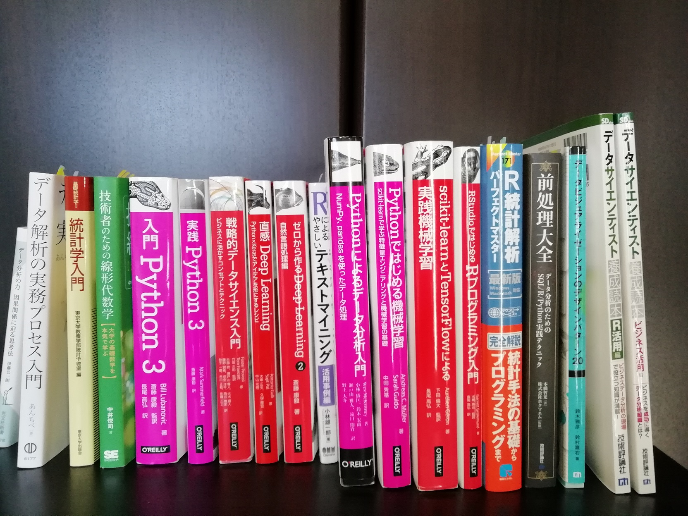

# Code storage space for Data Science
## study
* データサイエンス分野についての学習跡
* スクール（DataMix）で学んだ内容も一部掲載
* 使用した教材は主に下記

## practice
* スクール課題
  * アタックリスト作成によるROIの最大化/要因分析
  * 電力使用量データを用いた再配達問題の解決
  * 映画のレコメンドシステムの開発
* kaggle課題

## mylib
* 自作の便利関数をまとめる
